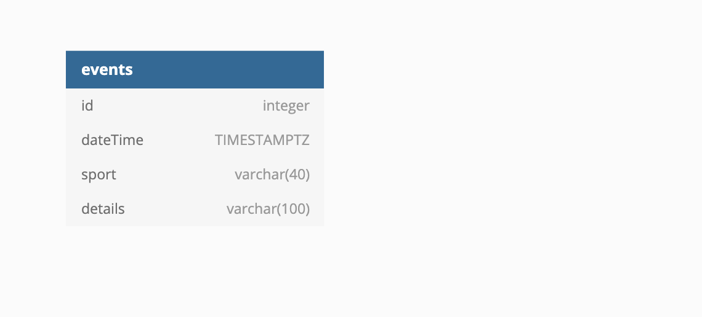

# Sportradar Coding Exercise

The backend for this challenge was set up with PostgreSQL and by creating API server with Node.js and Express.

## Database set up

- download and install postgreSQL and start it
- create postgres database:
  `CREATE DATABASE sr_exercise;`
  `CREATE USER sportradar WITH ENCRYPTED PASSWORD ‘Sportradar2021!';`
  `GRANT ALL PRIVILEGES ON DATABASE sr_exercise TO sportradar;`
- to start the db and create the events table:
  `psql -U sportradar sr_exercise;`
  `CREATE TABLE IF NOT EXISTS events (id integer PRIMARY KEY GENERATED BY DEFAULT AS IDENTITY, dateTime TIMESTAMPTZ, sport varchar(40), details varchar (100));`

## Screenshot

### Run the backend

To run the backend use `node index.js`
Open [http://localhost:3001](http://localhost:3001) to view the API.
