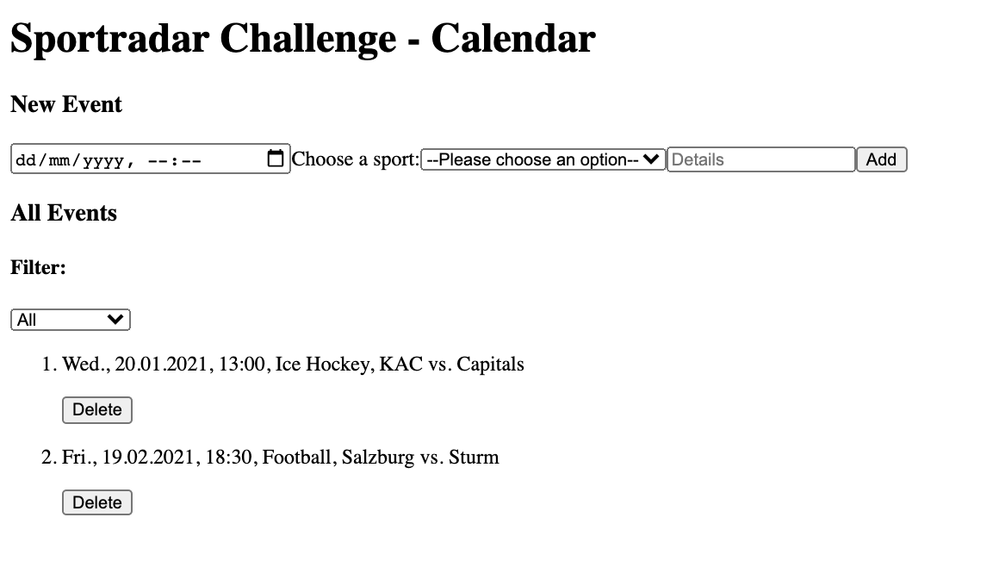

# Sportradar Coding Exercise

This React app was created for sportradar's coding challenge for the frontend. To display the date and time in the correct format I used 'date-fns' library.

## List of Features

- landing page with the list of sport events sorted by date
- user can add new sport event and delete existing ones
- filter option based on sport category

## Screenshot

### Run the app

To run the app in the development mode use `yarn start`
Open [http://localhost:3000](http://localhost:3000) to view it in the browser.
